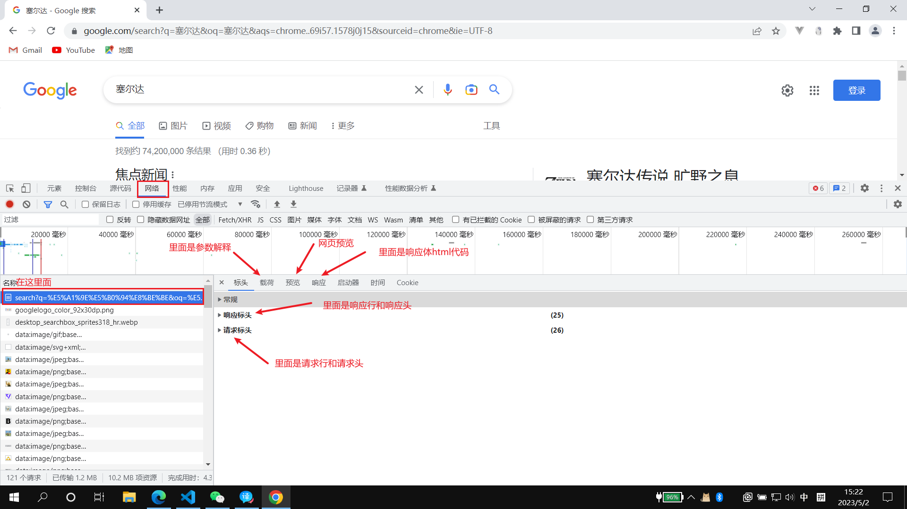

## 第一章： Ajax简介
### 1.1 Ajax简介
Ajax全称为Asynchronous Javascript And XML，即异步JS和XML
通过Ajax可以在浏览器中向服务器发送异步请求，<b>最大的优势：无刷新获取数据</b>
AJAX不是新的编程语言，而是一种将现有的标准组合在一起使用的新方式
### 1.2 XML简介 (现在已被JSON取代)
XML：可扩展标记语言
XML：被设计用来传输和存储数据
XML和HTML类似，不同点：HTML中都是预定义标签，XML中没有预定义标签，全是自定义标签，用来表示一些数据
现在已被JSON取代
### 1.3 AJAX 的特点
1. AJAX的优点
可以无刷新页面与服务端进行通信
允许你根据用户事件来更新部分页面内容
2. AJAX 的缺点
没有浏览历史，不能回退
存在跨域问题（同源）
SEO不友好（爬虫获取不到信息）
### 1.4 HTTP协议
HTTP(hypertext transport protocol)协议【超文本传输协议】，协议详细规定了【浏览器】与【万维网服务器】之间相互通信的规则。
1. 请求报文
重点是格式和参数
```
行    POST  /s?ie=utf-8  HTTP/1.1
头    Host: atguigu.com
      Cookie: name=guigu
      Content-type: application/x-www-form-urlencoded
      User-Agent: chrome 83
空行
体    (如果是GET请求，请求体为空；POST请求，请求体可不为空)
      username=admin&password=admin
```
2. 相应报文
```
行    HTTP/1.1 200 OK
头    Content-Type: text/html;charset=utf-8
      Content-length:2048
      Content-encoding:gzip
空行  
体    <html>
          <head>
          </head>
          <body>
              <h1>尚硅谷</h1>
          </body>
      </html>
```

### 1.5 网络控制台查看通信报文


## 第二章：Ajax的使用
### 2.1 express的框架使用
为什么我们在这里要使用express框架：因为ajax的需要一个服务器端，学习过程中我们用express框架建立一个基于nodejs的服务器端应用程序
基本使用方式：
创建一个xxx.js文件
```js
// 引入 express
const express = require("express")
// 创建应用对象
const app = express()
// 创建路由规则
// request 是对请求报文的封装
// respones 是对响应报文的封装
app.get("/", (request, response) => {
  response.send("Hello Express")
})
// 监听端口启动服务
app.listen(8000, () => {
  console.log("服务已启动,8000端口监听中...")
})
```
在cmd中输入node xxx.js，启动该xxx服务器端
### 2.2 GET请求的基本操作
创建 GET.html 和 server.js 文件
在server.js 中设置响应头和响应内容 **模拟服务器端**
```js
const express = require("express")
const app = express()
app.get("/server", (request, response) => {
  //设置响应头 允许跨域
  response.setHeader("Access-Control-Allow-Origin", "*")
  //设置响应体
  response.send("Hello Ajax")
})
// 监听端口启动服务
app.listen(8000, () => {
  console.log("服务已启动,8000端口监听中...")
})
```
**GET请求的基本操作**
GET.html中获取按钮节点，点击按钮触发事件，向服务器发送请求，获取数据
```js
//获取dom元素
btn = document.querySelector("button")
box = document.querySelector("#result")
btn.onclick = function () {
//创建对象
const xhr = new XMLHttpRequest()
//初始化，设置请求方法和url
xhr.open("Get", "http://127.0.0.1:8000/server")
//发送请求
xhr.send()
//事件绑定，处理服务端返回的结果
xhr.onreadystatechange = function () {
if (xhr.readyState === 4) {
  if (xhr.status >= 200 && xhr.status < 300) {
      console.log(xhr.status)//状态码
      console.log(xhr.statusText)//状态字符串
      console.log(xhr.getAllResponseHeaders)//返回所有的响应头
      console.log(xhr.response)//返回响应体
      console.log(xhr.responseText)//返回所有响应体字符串
      console.log(xhr)
      box.innerHTML = xhr.response;  //将响应体打印在div盒子里
      } else {
    }
  }
}
```
`readystate` 是 xhr 对象中的属性，表示状态五个阶段：
0 初始值
1 open方法调用完毕
2 send方法调用完毕
3 服务端返回部份结果
4 服务端成功返回所有结果
xhr 对象的其它属性：（行、头、空行、体） 
xhr.status => 状态码（200 404 403 401 500） (200到300都是成功，300不是)
xhr.statusText => 状态字符串 
xhr.getAllResponseHeaders() => 所有响应头 
xhr.response => 响应体

**AJAX GET请求里设置参数的方式：** 在url地址后用 ？ 开头，& 分隔多个参数
xhr.open('GET', 'http://127.0.0.1:8000/server?a=100&b=200&c=300')
发送请求后可在network中的Query String Parameters看到发送的参数详情。
问号后面的参数将被放到url查询字符串中a=100&b=200&c=300

### 2.3 POST请求的基本操作
**AJAX里的post请求：**
`xhr.open('POST','http://127.0.0.1:8000/server')`
server.js 中：
```js
app.post('/server',(request, response)=>{
  // 设置响应头,设置允许跨域
  response.setHeader('Access-Control-Allow-Origin','*')
  // 设置响应
  response.send(
    `<h1>hi,I'm from POST</h1>`
  )
})
```
**post请求该如何设置请求体参数**
```
xhr.send('a=100&b=200&c=300')
// xhr.send('a:100&b:200&c:300')
// xhr.send('hello')
```

### 2.4 设置请求头信息
在xhr.send()之前，使用setRequestHeader方法：
设置请求头
  `xhr.setRequestHeader("","")`
```js
 //设置请求体内容（send内参数）的类型：
  xhr.setRequestHeader('Content-Type','applicaton/x-www-form-urlencoded')
  //设置名字
  xhr.setRequestHeader('name','atguigu')
```

### 2.5 传递对象数据(响应JSON数据)
server.js中：
```js
app.post("/json-server", (request, response) => {
  //设置响应头 允许跨域
  response.setHeader("Access-Control-Allow-Origin", "*")
  //设置响应体
  const data = {
    name: "张三"
  }
  //配合第一种
  // response.send(JSON.stringify(data))
  //配合第二种
  response.send(data)
})
```
第一种 html文件中对接收到的data（字符串格式）进行转换： 手动转换：
```js
  xhr.onreadystatechange = function(){
    if(xhr.readyState === 4){
      if(xhr.status >= 200 && xhr.status <300){
        // 手动转换：
        let data = JSON.parse(xhr.response)
        console.log(data); // 对象
        result.innerHTML = data.name
      }}}
```
第二种 自动转换：
```js
// 设置响应体数据的类型:
      xhr.responseType = 'json'
...
xhr.onreadystatechange = function(){
        if(xhr.readyState === 4){
          if(xhr.status >= 200 && xhr.status <300){
            // 自动转换
            console.log(xhr.response); // 对象
            result.innerHTML = xhr.response.name
          }}}
```
### 2.6 请求超时与网络异常
准备：在server中用setTimeout设置延时： 模拟服务器的延迟响应
```js
app.get('/delay',(request, response)=>{
  // 设置响应头,设置允许跨域
  response.setHeader('Access-Control-Allow-Origin','*')

  setTimeout(()=>{
    // 设置响应
    response.send('延时响应')
  },3000)  //这里设置服务器3秒后返回响应
})
```
**请求超时**
在html中设置2秒的超时自动取消请求, 
xhr.timeout 为自动取消的时间限制；
ontimeout 方法，为当超过时间限制时调用的函数：
```js
 const xhr = new XMLHttpRequest()  
      // 超时自动取消 2s 设置
      xhr.timeout = 2000
      // 超时回调
      xhr.ontimeout = function(){
        result.innerHTML = '网络异常，请稍后重试'
        // alert('网络异常，请稍后重试')
      }
```
**网络异常**
网络异常回调，onerror 方法 ：  可用于监测请求异常
```js
xhr.onerror = function(){
        result.innerHTML = '对不起，您的网络异常，请检查网络'
      }
```
###2.7 手动取消请求
.abort() 方法
```js 
 const btns = document.querySelectorAll('button')
    //注意x需要在函数外部先赋一个空值
    let x = null

    btns[0].onclick = function(){
      x = new XMLHttpRequest()
      x.open('GET','http://127.0.0.1:8000/delay')
      x.send()
    }

    btns[1].onclick = function(){
      x.abort()  手动取消请求
    }
```
## 第三章：axios的AJAX
### 3.1 axios发送AJAX Get请求
axios.get("url",{参数,请求头})
```js
 axios.defaults.baseURL = "http://127.0.0.1:8000"
  btn[0].onclick = function () {
    //axios.get("url",{参数,请求头})
    axios.get("/axios-server", {
      //参数
      params: {
        a: 100,
        b: 200
      },
      //请求头信息
      headers: {
        vip: 7
      }
    }).then(value => {  //处理数据
      console.log(value)
    })
  }
```
### 3.2 axios发送AJAX POST请求
axios.post("url",{请求体信息},{参数,请求头})
```js
  btn[1].onclick = function () {
    //axios.post("url",{请求体信息},{参数,请求头})
    axios.post("/axios-server", {
      //请求体信息
      text: "哈哈"
    },
      {
        //参数
        params: {
          a: 100,
          b: 200
        },
        //请求头
        headers: {
          vip: 7
        }
      }).then(value => {  //处理数据
        console.log(value)
      })
  }
```
### 3.3 axios通用方法发送请求
```js
btn[2].onclick = function () {
    //通用方法
    axios({
      //请求方法
      method: "POST",
      url: "/axios-server",
      params: {
        a: 100,
        b: 200
      },
      headers: {
        vip: 7
      },
      data: {
        text: "哈哈"
      }
    }).then(value => {  //处理数据
      console.log(value.data)
    })
  }
```
## 第四章：fetch函数发送AJAX请求
```js
btn.onclick = function () {
    fetch("http://127.0.0.1:8000/fetch-server?a=100&b=200", {
      method: "POST",
      headers: {
        vip: 7
      },
      body: "text=哈哈哈"
    }).then(response => {
      // console.log(response)
      return response.json()
    }).then(value => {
      console.log(value)
    })
  }
```
## 第五章：跨域
### 5.1 同源策略
同源策略（Same-Origin Policy）最早由Netscape公司提出，是浏览器的一种安全策略。
同源：协议、域名、端口号 必须完全相同。
跨域： 违背同源策略就是跨域。
### 5.2 JSONP (非官方跨域策略)
JSONP是什么？ JSON with Padding， 是一个非官方的跨域解决方案，纯粹凭借程序员的聪明才智开发出来，只支持get请求。
JSONP怎么工作？ 在网页有一些标签天生具有跨域能力，比如：img link iframe scrpt。 **JSONP就是利用script标签的跨域能力来发送请求的。**
### 5.3 JSONP的使用 (检查用户名是否已经存在案例)
准备：
```js
app.get("/check-server", (request, response) => {
  const data = {
    exist: 1,
    username: "111",
    msg: "该用户名已存在"
  }
  //返回响应体要以js的形式
  response.send(`headle(${JSON.stringify(data)})`)
})
```
实现：
```js
 input = document.querySelector("input")
  p = document.querySelector("p")
  function headle(data) {
    // console.log(input.value)
    let username = input.value
    if (username === data.username) {
      input.style.border = "1px solid hotpink"
      p.innerHTML = data.msg
    }
  }
  input.onblur = function () {
    //发送请求
    const script = document.createElement("script")
    script.src = "http://127.0.0.1:8000/check-server"
    document.body.appendChild(script)
  }
```
### 5.4 CORS(官方跨域策略)
1. CORS 是什么？ 
   CORS(Cross-Origin Resource Sharing), 跨域资源共享。CORS是官方的跨域解决方案，它的特点是不需要客户端做任何特殊的操作，完全在服务器中进行处理，支持get和post请求。跨域资源共享标准新增了一组HTTP首部字段，允许服务器声明哪些资源站通过浏览器有权限访问那些资源
2. CORS 怎么工作？ 
   CORS是通过设置一个响应头来告诉浏览器，该请求允许跨域，浏览器收到该响应以后就会对响应放行。
3. 关于首部字段设置的具体文档
   https://developer.mozilla.org/zh-CN/docs/Web/HTTP/CORS
```js
app.post("/server", (request, response) => {
  //设置响应头 允许跨域
  response.setHeader("Access-Control-Allow-Origin", "*")
  //允许携带请求头
  response.setHeader("Access-Control-Allow-Headers", '*')
  //允许携带请求方法
  response.setHeader("Access-Control-Allow-Method", "*")
  //设置响应体
  response.send("Hello Ajax")
})
```